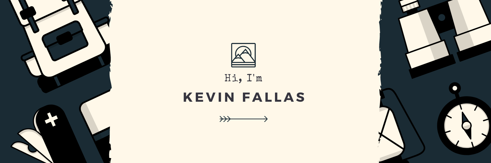

Hi! 👋

I’m Kevin, a software engineer/computer science student at Tecnológico de Costa Rica.

<!-- Want to see my projects? [Check out my portfolio.](https:kevinfallas.dev) -->

<!-- ## 📝 Latest Blog Posts -->

<!--   -->

<!-- BLOG-POST-LIST:START -->

<!-- BLOG-POST-LIST:END -->

<!--   -->

## 📌 Pinned Repositories

 

 
 

 
 

## &#x1f4c8; GitHub Stats

 

 
 

## 💼 Skills

More Skills

 

 

 
